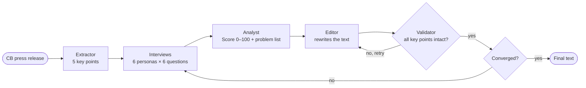

# Communicado

**Closed-loop optimization of central bank communication through LLM-simulated focus groups.**


-d97757.svg)


A central bank publishes one press release written in expert language. A pensioner and a financial analyst read the same sentence — and react in **opposite** ways. Communicado closes this gap: it runs a press release through a multi-agent *closed loop* — synthetic focus-group interviews → analysis → rewriting → validation — until the text becomes clear to every audience without losing a single fact.

Built around real press releases of the Bank of Russia. Works out of the box **without any API keys** (deterministic mock mode), or with the [Anthropic API](https://platform.claude.com/) for live runs.

*Читайте эту страницу [по-русски](README.ru.md).*

---

## Why

| Fact | Source |
|------|--------|
| Only ~30% of households update expectations after a central bank decision | Lamla & Vinogradov (2024, *JME*) |
| Flesch Reading Ease of original releases ≈ 35 — "very difficult" | Oborneva (2006), Russian adaptation |
| Experts and non-experts react to the *same* CB phrase in opposite directions | Kim & Lee, *Bounded Rationality in CB Communication* |
| 37% of Russians get economic news from Telegram | NAFI (2024) |

Real focus groups take weeks and cost money. LLM-simulated ones take minutes — recent research (Argyle et al. 2023; Horton 2023) shows LLM "silicon samples" reproduce human survey behavior with ρ ≈ 0.85. Communicado turns that idea into a working feedback loop for communication policy.

## How it works



Six agent roles (extractor, interviewer, 6 personas, analyst, editor, validator) talk to each other over a single LLM gateway ([`llm.py`](llm.py)). The validator guarantees **factual integrity**: if any of the 5 extracted key points is lost or an investment recommendation sneaks in, the edit is rejected and redone.

### Three independent metric systems

Relying on a single LLM judge is fragile, so every iteration is scored three ways:

- **Communication Score** (LLM, 0–100) — comprehension across the persona panel, calibrated with anchor points;
- **Flesch Reading Ease** — deterministic readability formula adapted for Russian (Oborneva, 2006) + jargon counter over a CB-specific stop list;
- **Sentiment Balance** — dictionary-based ratio of alarming vs. reassuring words, fully LLM-independent.

## Synthetic personas

Six personas with 19-field profiles, differentiated along 7 axes taken from the literature (financial literacy, information channel, debt exposure, age, institutional trust, cognitive gap, attention rate). The profile format mirrors the Bank of Russia's own focus-group methodology.

| Persona | Role | Key axis | Attention |
|---------|------|----------|-----------|
| Valentina, 67 | Pensioner, Voronezh | Low literacy, TV news, high anxiety | ~25% |
| Alexey, 38 | CFO, Moscow | Expert, reads cbr.ru directly | ~95% |
| Olga, 34 | Mortgage holder, Kazan | Maximum rate sensitivity | ~60% |
| Sergey, 45 | Truck driver, Chelyabinsk | Minimal assets, minimal attention | ~15% |
| Pavel, 51 | Business owner, Krasnodar | Credit channel, pricing power | ~30% |
| Daniil, 22 | Economics student, St. Petersburg | Youth, social media, theory without practice | ~15% |

## Results

On 4 real Bank of Russia press releases (Oct 2025 – Mar 2026), 6 personas, adaptive interviews:

- **4/4** runs show monotonic Score growth;
- **+27** average Communication Score gain (from 35–42 up to 62–72);
- **0.0** sentiment balance after optimization — alarm neutralized;
- **72** best score (release of 20.03.2026, key rate cut to 15%).

### Before / after (release of 20.03.2026)

| Original (Score 42) | After 3 iterations (Score 72) |
|---------------------|-------------------------------|
| "снизить ключевую ставку на 50 б.п., до 15,00% годовых" *(cut the key rate by 50 bp, to 15.00% per annum)* | "снизить ключевую ставку на 0,5 процентного пункта — до 15%. От этой ставки зависят проценты по вкладам и кредитам" *(…this rate is what your deposit and loan rates depend on)* |
| "устойчивые показатели текущего роста цен остаются в диапазоне 4–5% в пересчете на год" | "базовая инфляция — рост цен на товары и услуги, кроме продуктов и топлива — остается в диапазоне 4–5% в год" *(core inflation explained in plain words)* |
| "значимо выросла неопределенность со стороны внешних условий" | "ситуация в мире стала менее предсказуемой, и это может повлиять на российскую экономику" *(the world got less predictable, and it may affect the economy)* |

## One release → every channel

Each communication channel runs its own closed loop with the personas of its target audience:

| Channel | Audience | Score | Style |
|---------|----------|-------|-------|
| Official release (cbr.ru) | Alexey, Pavel | 45 → **68** | Formal, terminology allowed |
| CB Telegram channel | Alexey, Daniil, Olga | 45 → **78** | Accessible, ≤1000 chars |
| Business media | Alexey, Pavel | 45 → **75** | Numbers, forecasts, credit focus |
| VK Clips / Reels | Daniil, Olga | 45 → **78** | 60-second script, informal |

## Telegram bot: communication of one

The bot takes personalization to its logical end — a press release explained *for you personally*:

1. **Onboarding** — the bot asks about age, occupation, mortgage, savings, news sources;
2. **Persona building** — answers become a 19-field profile;
3. **Closed loop** — the release is optimized against that single persona;
4. **Personal text + Q&A** — the user receives their own explanation and can ask follow-up questions.

## Quick start

```bash
git clone https://github.com/bzgly/communicado.git
cd communicado
pip install -r requirements.txt

# Interactive demo — runs in mock mode, no API key needed
streamlit run app.py
```

To run against the real Claude API:

```bash
cp .env.example .env    # put your ANTHROPIC_API_KEY there
python run_one.py release 3     # optimize the latest release, 3 iterations
python run_one.py channel vk_clips
```

Other entry points:

```bash
python -m pytest tests/ -v      # 32 unit/integration tests (mock mode)
USE_MOCK=0 python test_prod.py  # smoke tests against the live API
python bot.py                   # Telegram bot (needs BOT_TOKEN in .env)
```

Environment variables: `ANTHROPIC_API_KEY` (live mode), `CLAUDE_MODEL` (default `claude-opus-4-8`), `USE_MOCK=1/0` (force mock on/off), `BOT_TOKEN` (bot only).

## Project structure

```
communicado/
├── engine.py             # closed loop: extract → interview → analyze → edit → validate
├── llm.py                # LLM gateway: Anthropic API + deterministic mock mode
├── interview.py          # interviewer agent: scripted & adaptive (LLM follow-ups) modes
├── personas.py           # 6 personas, 19 fields, 7 literature-grounded axes
├── prompts.py            # system prompts for every agent role
├── readability.py        # deterministic metrics: Flesch-RU, jargon count, sentiment
├── channels.py           # 5 CB communication channels with target audiences
├── sample_releases.py    # 4 real Bank of Russia press releases
├── mock_data.py          # calibrated mock responses for API-free demo
├── app.py                # Streamlit demo (loop + channels + comparison)
├── bot.py                # Telegram bot for personal communication
├── run_one.py            # single benchmark run → results/*.json
├── run_benchmarks.py     # batch runs for the presentation
├── build_charts.py       # Plotly charts from results
├── build_presentation.py # PDF deck generator (reportlab)
├── test_prod.py          # smoke tests against the live API
├── tests/                # unit & integration tests
└── docs/                 # presentation.pdf, defense speech
```

## Limitations

- **LLMs stereotype.** Personas are calibrated along 7 literature-based axes; the next step is validation against real focus-group transcripts.
- **LLM scores fluctuate.** That is exactly why deterministic metrics (Flesch, jargon count, sentiment balance) run alongside.
- **Not a replacement for real focus groups** — a rapid-iteration tool between them: minutes instead of weeks.
- **Simplification can amplify anxiety** (Kim & Lee effect): a clearer text delivers an alarming signal more strongly. The sentiment metric watches for this.

## References

1. Argyle et al. (2023). "Out of One, Many." *Political Analysis*
2. Blinder et al. (2024). "Central Bank Communication." *JEL*
3. Bholat et al. (2019). "Enhancing Central Bank Communications." *Bank of England*
4. Cloyne et al. (2024). "Homeownership and Monetary Policy." *JME*
5. Christelis et al. (2020). "Trust in the Central Bank." *IJCB*
6. D'Acunto et al. (2024). "Household Inflation Expectations." *NBER*
7. Horton (2023). "Homo Silicus." *NBER*
8. Kim & Lee. "Bounded Rationality in Central Bank Communication"
9. Lamla & Vinogradov (2024). "Central Bank Announcements." *JME*
10. Jung & Mongelli (2025). "Direct Communication." *ECB*
11. Oborneva, I.V. (2006). Flesch formula adaptation for Russian
12. Bank of Russia WP 148 (2024). "Households' Inflation Expectations: RCT"

---

Study project on central bank communication. Slides: [`docs/presentation.pdf`](docs/presentation.pdf) · Defense speech: [`docs/speech.md`](docs/speech.md) · [Русская версия](README.ru.md)
